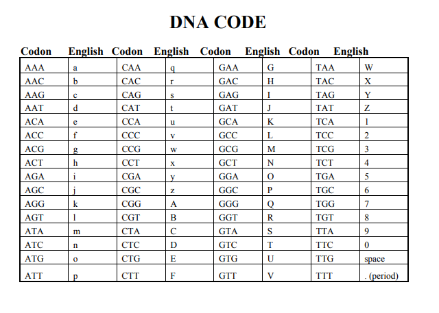
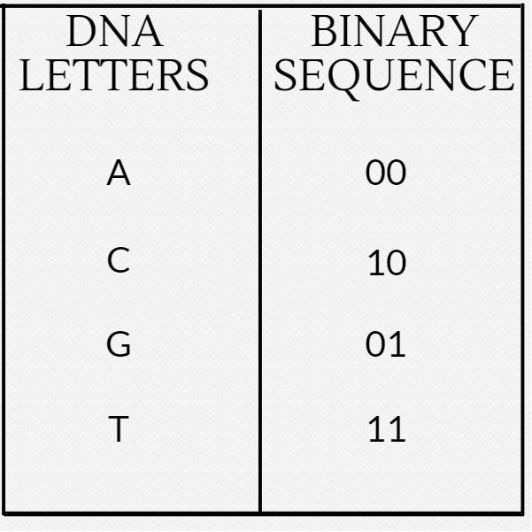

CTF-Katana
===============

> John Hammond | February 1st, 2018

--------------------------


This repository, at the time of writing, will just host a listing of tools and commands that may help with CTF challenges. I hope to keep it as a "live document," and ideally it will not die out like the old "tools" page I had made ([https://github.com/USCGA/tools](https://github.com/USCGA/tools)).

Hopefully, at some point I will develop software that will run through a lot of the low-hanging fruit and simple command-line tools, generate a report and have all the output in one place.


---------------


Known Exploits
------------------

* Java RMI
	
	Metasploit module: `exploit/multi/misc/java_rmi_server`

	When testing this, responses are _known to come back with an error or exception_. Your code MAY VERY WELL still be executing. Try and run commands that include a callback. And _use Python_ to live off the land and try avoid special characters, like `|` pipes! [ysoserial](https://github.com/frohoff/ysoserial) is a good tool for deserializing Java code to take advantage of this vulnerability.
	
* Heartbleed

	Metasploit module: `auxiliary/scanner/ssl/openssl_heartbleed`

	Be sure to use `set VERBOSE true` to see the retrieved results. This can often contain a flag or some valuable information. 

* libssh - SSH

	`libssh0.8.1` (or others??) is vulnerable to an easy and immediate login. Metasploit module: `auxiliary/scanner/ssh/libssh_auth_bypass`. Be sure to `set spawn_pty true` to actually receive a shell! Then `sessions -i 1` to interact with the shell spawned (or whatever appropriate ID)

* Bruteforcing RDP

	Bruteforcing RDP with `hydra` or `ncrack` is __NOT ALWAYS ADVISABLE__ because of Cred-SSB. An option _might_ be to script xrdp to automate against a password or word list... __but THIS IS NOT TESTED__.

Excess
--------

* wifite

	Brute-force a Wi-Fi access point.

* [impacket](https://github.com/SecureAuthCorp/impacket)

	Tool to quickly spin up a Samba share.

* [enum4linux](https://github.com/portcullislabs/enum4linux)

	Script to scan Windows Samba shares. VERY GOOD TO RUN FOR WINDOWS ENUMERATION.

* Drupal [drupalgeddon](https://github.com/dreadlocked/Drupalgeddon2)

	Attack script for old or outdated Drupal servers. Usually very effective.

Esoteric Languages
-----------------------


* [https://tio.run/](https://tio.run/)

	An online tool that has a ton of Esoteric language interpreters. 

* Brainfuck

	This language is easily detectable by its huge use of plus signs, braces, and arrows. 	There are plenty of online interpreters, like this one: [https://copy.sh/brainfuck/](https://copy.sh/brainfuck/) Some example code:

```
++++++++++[>+>+++>+++++++>++++++++++<<<<-]>>>>+++++++++++++++++.--.--------------.+++++++++++++.----.-----------
--.++++++++++++.--------.<------------.<++.>>----.+.<+++++++++++.+++++++++++++.>+++++++++++++++++.-------------
--.++++.+++++++++++++++.<<.>>-------.<+++++++++++++++.>+++..++++.--------.+++.<+++.<++++++++++++++++++++++++++
.<++++++++++++++++++++++.>++++++++++++++..>+.----.>------.+++++++.--------.<+++.>++++++++++++..-------.++.
```

* COW

	This language is easily identified by numerous "MOO" statements and random capitalization. It has an option on [https://tio.run/](https://tio.run/).

* [Malboge]

	An esoteric language that looks a lot like Base85... but isn't. Often has references to "Inferno" or "Hell" or "Dante." Online interpreters like so: [http://www.malbolge.doleczek.pl/](http://www.malbolge.doleczek.pl/) Example code:

```
(=<`#9]~6ZY32Vx/4Rs+0No-&Jk)"Fh}|Bcy?`=*z]Kw%oG4UUS0/@-ejc(:'8dc
```

* [Piet]

	A graphical programming language... looks like large 8-bit pixels in a variety of colors. Can be interpreted with the tool [`npiet`][npiet]


* [Ook!](http://esolangs.org/wiki/ook!)

	A joke language. Recognizable by `.` and `?`, and `!`.

```
Ook. Ook? Ook. Ook. Ook. Ook. Ook. Ook. Ook. Ook. Ook. Ook. Ook. Ook. Ook. Ook.
Ook. Ook. Ook. Ook. Ook! Ook? Ook? Ook. Ook. Ook. Ook. Ook. Ook. Ook. Ook. Ook.
Ook. Ook. Ook. Ook. Ook. Ook. Ook. Ook. Ook. Ook? Ook! Ook! Ook? Ook! Ook? Ook.
Ook! Ook. Ook. Ook? Ook. Ook. Ook. Ook. Ook. Ook. Ook. Ook. Ook. Ook. Ook. Ook.
Ook. Ook. Ook! Ook? Ook? Ook. Ook. Ook. Ook. Ook. Ook. Ook. Ook. Ook. Ook. Ook?
Ook! Ook! Ook? Ook! Ook? Ook. Ook. Ook. Ook! Ook. Ook. Ook. Ook. Ook. Ook. Ook.
```


Steganography
---------------------

* [StegCracker][StegCracker]

	Don't ever forget about [`steghide`][steghide]! This tool can use a password list like `rockyou.txt` with steghide. SOME IMAGES CAN HAVE MULTIPLE FILED ENCODED WITH MULTIPLE PASSWORDS.

* [`steg_brute.py`](https://github.com/Va5c0/Steghide-Brute-Force-Tool)

	This is similar to `stegcracker` above.

* [`openstego`][OpenStego]

	A [Java][Java] [`.JAR`][JAR] tool, that can extract data from an image. A good tool to use on guessing challenges, when you don't have any other leads. We found this tool after the [Misc50](http://0xahmed.ninja/nullcon-hackim18-ctf-writeups/) challenge from [HackIM 2018](https://ctftime.org/event/566)

* [`Stegsolve.jar`][Stegsolve.jar]

	A [Java][Java] [`.JAR`][JAR] tool, that will open an image and let you as the user arrow through different renditions of the image (viewing color channels, inverted colors, and more). The tool is surprisingly useful.

* [`steghide`][steghide]

	A command-line tool typically used alongside a password or key, that could be uncovered some other way when solving a challenge. 

# WHEN GIVEN A FILE TO WORK WITH, DO NOT FORGET TO RUN THIS STEGHIDE WITH AN EMPTY PASSWORD!

* [ImageHide](https://www.softpedia.com/get/Security/Encrypting/ImageHide.shtml)

	For PNG images (or BMP) images, there exists a Windows utility that can hide "ENCRYPTED" text within the LSB. If you also happen to have passwords, you can decrypt this and potentially find a flag. [https://www.softpedia.com/get/Security/Encrypting/ImageHide.shtml](https://www.softpedia.com/get/Security/Encrypting/ImageHide.shtml)

* [stegoVeritas](https://github.com/bannsec/stegoVeritas/)

	Another steganography tool. A simple command-line tool and super easy to use -- definitely one to at least try.

* Unicode Steganography / Zero-Width Space Characters

	Some text that may be trying to hide something, in a seemingly innocent way, like "Hmm, there may be something hiding here..." may include zero-width characters. This is a utility that might help: [https://330k.github.io/misc_tools/unicode_steganography.html](https://330k.github.io/misc_tools/unicode_steganography.html) ... Other options are just gross find and replace operations in Python IDLE.

* Online LSB Tools

	There are many online LSB tools that work in different ways. If you are given a file that you know is part of a Least Significant Bit challenge, try these tools:

	[https://manytools.org/hacker-tools/steganography-encode-text-into-image/](https://manytools.org/hacker-tools/steganography-encode-text-into-image/) Only supports PNG
	[https://stylesuxx.github.io/steganography/](https://stylesuxx.github.io/steganography/)

* Other stego tools:

	[https://github.com/DominicBreuker/stego-toolkit](https://github.com/DominicBreuker/stego-toolkit)
	
* [`zsteg`][zsteg]

	Command-line tool for use against Least Significant Bit steganography... unfortunately only works against PNG and BMP images.

* [`jsteg`][jsteg]

    Another command-line tool to use against JPEG images. [https://github.com/lukechampine/jsteg](https://github.com/lukechampine/jsteg) Handy for Hackerrank Codefest CTF 2018.

* [Jstego][Jstego]

    A GUI tool for JPG steganography. [https://sourceforge.net/projects/jstego/](https://sourceforge.net/projects/jstego/) It is a [Java][Java] [JAR] file similar to stegsolve.jar

* Morse Code

	Always test for this if you are seeing two distinct values... _it may not always be binary!_ Online decoders like so: [https://morsecode.scphillips.com/translator.html](https://morsecode.scphillips.com/translator.html). If you need to be case-sensistive or include a bit more stuff like numbers and punctuation, use this code: [https://gist.github.com/JohnHammond/961acabfd85a8715220fa79492b25368](https://gist.github.com/JohnHammond/961acabfd85a8715220fa79492b25368)

	If you find Morsecode in the "international written form", like "dah-dit-dit-dah" etcetera, you can use this code: [https://gist.github.com/JohnHammond/7d3ddb167fa56f139dc4419091237b51](https://gist.github.com/JohnHammond/7d3ddb167fa56f139dc4419091237b51) ... which was carved out of this resource: [https://morsecode.scphillips.com/morse.html](https://morsecode.scphillips.com/morse.html)

* Whitespace

	Tabs and spaces could be representing 1's and 0's and treating them as a binary message... or, they could be whitespace done with [`snow`][snow] or an esoteric programming language interpreter: [https://tio.run/#whitespace](https://tio.run/#whitespace)

* DNA Codes

    When given a sequence with only A, C, G, T , there is an online mapping for these. Try this:

    
    

* [`snow`][snow]

	A command-line tool for whitespace steganography (see above).

* SONIC Visualizer (audio spectrum)

	Some classic challenges use an audio file to hide a flag or other sensitive stuff. SONIC visualizer easily shows you [spectrogram](https://en.wikipedia.org/wiki/Spectrogram). __If it sounds like there is random bleeps and bloops in the sound, try this tactic!__

* [Detect DTMF Tones]

	Audio frequencies common to a phone button, DTMF: [https://en.wikipedia.org/wiki/Dual-tone_multi-frequency_signaling](https://en.wikipedia.org/wiki/Dual-tone_multi-frequency_signaling).

* Phone-Keypad

	Some messages may be hidden with a string of numbers, but really be encoded with old cell-phone keypads, like text messaging with numbers repeated:


* [`hipshot`][hipshot]

	A [Python] module to compress a video into a single standalone image, simulating a long-exposure photograph. Was used to steal a [QR code] visible in a video, displayed through "Star Wars" style text motion.	

* [QR code]

	A small square "barcode" image that holds data.

* [`zbarimg`][zbarimg]

	A command-line tool to quickly scan multiple forms of barcodes, [QR codes] included. Installed like so on a typical [Ubuntu] image: 

```
sudo apt install zbar-tools
```
	
* Punctuation marks `!`, `.` and `?`

	I have seen some challenges use just the end of `.` or `?` or `!` to represent the [Ook](http://esolangs.org/wiki/ook!) esoteric programming language. Don't forget that is a thing!

Cryptography
-----------------


* Keyboard Shift
	
	[https://www.dcode.fr/keyboard-shift-cipher](https://www.dcode.fr/keyboard-shift-cipher) If you see any thing that has the shape of a sentence but it looks like nonsense letters, and notes some shift left or right, it may be a keyboard shift...

* Bit Shift

	Sometimes the letters may be shifted by a stated hint, like a binary bit shift ( x >> 1 ) or ( x << 1 ).

* Reversed Text

	Sometimes a "ciphertext" is just as easy as reversed text. Don't forgot to check under this rock! You can reverse a string in [Python] like so:

```
"UOYMORFEDIHOTGNIYRTEBTHGIMFTCA.TAHTTERCESASISIHT"[::-1]
```

* XOR

	ANY text could be XOR'd. Techniques for this are Trey's code, and XORing the data against the known flag format. Typically it is given in just hex, but once it is decoded into raw binary data, it gives it keeps it's hex form (as in `\xde\xad\xbe\xef` etc..) Note that you can do easy XOR locally with Python like so (you need `pwntools` installed):

	``` python
	python >>> import pwn; pwn.xor("KEY", "RAW_BINARY_CIPHER")
	```

# IF YOU KNOW A DECENT CRIB (PLAINTEXT), USE CYBERCHEF TO HELP DETERMINE THE KEY

# DO NOT FORGET TO JUST BRUTEFORCE JUST THE FIRST BYTE, OR TWO BYTES OR THREE BYTES.


* Caesar Cipher

	The most classic shift cipher. Tons of online tools like this: [https://www.dcode.fr/caesar-cipher](https://www.dcode.fr/caesar-cipher) or use `caesar` as a command-line tool (`sudo apt install bsdgames`) and you can supply a key for it. Here's a one liner to try all letter positions:

	```
	cipher='jeoi{geiwev_gmtliv_ws_svmkmrep}' ; for i in {0..25}; do echo $cipher | caesar $i; done
	```

	__Be aware!__ Some challenges include punctuation in their shift! If this is the case, try to a shift within all 255 ASCII characters, not just 26 alphabetical letters!

* `caesar`

	A command-line caesar cipher tool (noted above) found in the `bsdgames` package.

* [Atbash Cipher]

	If you have some text that you have no idea what it is, try the [Atbash cipher]! It's a letter mapping, but the alphabet is reversed: like `A` maps to `Z`, `B` maps to `Y` and so on. There are tons of online tools to do this ([http://rumkin.com/tools/cipher/atbash.php](http://rumkin.com/tools/cipher/atbash.php)), and you can build it with [Python].

* [Vigenere Cipher]

	[http://www.mygeocachingprofile.com/codebreaker.vigenerecipher.aspx](http://www.mygeocachingprofile.com/codebreaker.vigenerecipher.aspx), [https://www.guballa.de/vigenere-solver](https://www.guballa.de/vigenere-solver) and personal Python code here: [https://pastebin.com/2Vr29g6J](https://pastebin.com/2Vr29g6J)


* Gronsfeld Cipher

	A variant of the Vignere cipher that uses numbers insteads of letters. [http://rumkin.com/tools/cipher/gronsfeld.php](http://rumkin.com/tools/cipher/gronsfeld.php)

* Beaufourt Cipher

	[https://www.dcode.fr/beaufort-cipher](https://www.dcode.fr/beaufort-cipher)


* Python random module cracker/predictor

	[https://github.com/tna0y/Python-random-module-cracker](https://github.com/tna0y/Python-random-module-cracker)... helps attack the Mersenne Twister used in Python's random module. 

* Transposition Cipher

* RSA: Classic RSA

	Variables typically given: `n`, `c`, `e`. _ALWAYS_ try and give to [http://factordb.com](http://factordb.com). If `p` and `q` are able to be determined, use some RSA decryptor; handmade code available here: [https://pastebin.com/ERAMhJ1v](https://pastebin.com/ERAMhJ1v)

* RSA: Multi-prime RSA

* RSA: `e` is 3 (or small)

	If `e` is 3, you can try the cubed-root attack. If you the cubed root of `c`, and if that is smaller than the cubed root of `n`, then your plaintext message `m` is just the cubed root of `c`! Here is [Python] code to take the cubed root:

```
def root3rd(x):
    y, y1 = None, 2
    while y!=y1:
        y = y1
        y3 = y**3
        d = (2*y3+x)
        y1 = (y*(y3+2*x)+d//2)//d
    return y 
``` 

* RSA: Weiner's Little D Attack

	The telltale sign for this kind of challenge is an enormously large `e` value. Typically `e` is either 65537 (0x10001) or `3` (like for a Chinese Remainder Theorem challenge). Some stolen code available here: [https://pastebin.com/VKjYsDqD](https://pastebin.com/VKjYsDqD)

* RSA: Chinese Remainder Attack

	These challenges can be spotted when given  mutiple `c` cipher texts and multiple `n` moduli. `e` must be the same number of given `c` and `n` pairs. Some handmade code here: [https://pastebin.com/qypwc6wH](https://pastebin.com/qypwc6wH)

* [LC4]

	This is an adaptation of RC4... just not. There is an implementation available in Python.
	[https://github.com/dstein64/LC4/blob/master/documentation.md](https://github.com/dstein64/LC4/blob/master/documentation.md)

* Elgamal

* Affine Cipher

* Substitution Cipher (use quip quip!)

	[https://quipqiup.com/](https://quipqiup.com/)

* Railfence Cipher

	[http://rumkin.com/tools/cipher/railfence.php](http://rumkin.com/tools/cipher/railfence.php)


* [Playfair Cipher]

	racker: [http://bionsgadgets.appspot.com/ww_forms/playfair_ph_web_worker3.html](http://bionsgadgets.appspot.com/ww_forms/playfair_ph_web_worker3.html)

* Polybius Square

	[https://www.braingle.com/brainteasers/codes/polybius.php](https://www.braingle.com/brainteasers/codes/polybius.php)

* The Engima

	[http://enigma.louisedade.co.uk/enigma.html](http://enigma.louisedade.co.uk/enigma.html),
	[https://www.dcode.fr/enigma-machine-cipher](https://www.dcode.fr/enigma-machine-cipher)

* AES ECB

	The "blind SQL" of cryptography... leak the flag out by testing for characters just one byte away from the block length. 


* Two-Time Pad


Networking
---------------

* [Wireshark]

	The go-to tool for examining [`.pcap`][PCAP] files. 

* [Network Miner]

	Seriously cool tool that will try and scrape out images, files, credentials and other goods from [PCAP] and [PCAPNG] files.

* [PCAPNG]

	Not all tools like the [PCAPNG] file format... so you can convert them with an online tool [http://pcapng.com/](http://pcapng.com/) or from the command-line with the `editcap` command that comes with installing [Wireshark]:

```
editcap old_file.pcapng new_file.pcap
```

* [`tcpflow`][tcpflow]

	A command-line tool for reorganizing packets in a PCAP file and getting files out of them. __Typically it gives no output, but it creates the files in your current directory!__ 

```
tcpflow -r my_file.pcap
ls -1t | head -5 # see the last 5 recently modified files
```


* [PcapXray]

	A GUI tool to visualize network traffic.

PHP
------------

* Magic Hashes

	A common vulnerability in [PHP] that fakes hash "collisions..." where the `==` operator falls short in [PHP] type comparison, thinking everything that follows `0e` is considered scientific notation (and therefore 0). More valuable info can be found here: [https://github.com/spaze/hashes](https://github.com/spaze/hashes), but below are the most common breaks.

| Plaintext | MD5 Hash |
| --------- | -------- |
|240610708|0e462097431906509019562988736854|
|QLTHNDT|0e405967825401955372549139051580|
|QNKCDZO|0e830400451993494058024219903391|
|PJNPDWY|0e291529052894702774557631701704|
|NWWKITQ|0e763082070976038347657360817689|
|NOOPCJF|0e818888003657176127862245791911|
|MMHUWUV|0e701732711630150438129209816536|
|MAUXXQC|0e478478466848439040434801845361|
|IHKFRNS|0e256160682445802696926137988570|
|GZECLQZ|0e537612333747236407713628225676|
|GGHMVOE|0e362766013028313274586933780773|
|GEGHBXL|0e248776895502908863709684713578|
|EEIZDOI|0e782601363539291779881938479162|
|DYAXWCA|0e424759758842488633464374063001|
|DQWRASX|0e742373665639232907775599582643|
|BRTKUJZ|00e57640477961333848717747276704|
|ABJIHVY|0e755264355178451322893275696586|
|aaaXXAYW|0e540853622400160407992788832284|
|aabg7XSs|0e087386482136013740957780965295|
|aabC9RqS|0e041022518165728065344349536299|

| Plaintext | SHA1 Hash |
| --------- | --------- |
|aaroZmOk|0e66507019969427134894567494305185566735|
|aaK1STfY|0e76658526655756207688271159624026011393|
|aaO8zKZF|0e89257456677279068558073954252716165668|
|aa3OFF9m|0e36977786278517984959260394024281014729|


* `preg_replace`

	A bug in older versions of [PHP] where the user could get remote code execution
	
	[http://php.net/manual/en/function.preg-replace.php](http://php.net/manual/en/function.preg-replace.php)


* [`phpdc.phpr`][phpdc.phpr]

	A command-line tool to decode [`bcompiler`][bcompiler] compiled [PHP] code.


* [`php://filter` for Local File Inclusion](https://www.idontplaydarts.com/2011/02/using-php-filter-for-local-file-inclusion/)

	A bug in [PHP] where if GET HTTP variables in the URL are controlling the navigation of the web page, perhaps the source code is `include`-ing other files to be served to the user. This can be manipulated by using [PHP filters](http://php.net/manual/en/filters.php) to potentially retrieve source code. Example like so:

```
http://xqi.cc/index.php?m=php://filter/convert.base64-encode/resource=index
```


* `data://text/plain;base64`

	A [PHP] stream that can be taken advantage of if used and evaluated as an `include` resource or evaluated. Can be used for RCE: check out this writeup: [https://ctftime.org/writeup/8868](https://ctftime.org/writeup/8868) ... TL;DR:

```
http://103.5.112.91:1234/?cmd=whoami&page=data://text/plain;base64,PD9waHAgZWNobyBzeXN0ZW0oJF9HRVRbJ2NtZCddKTsgPz4=
``` 


PDF Files
-------------

* `pdfinfo`	
	
	A command-line tool to get a basic synopsis of what the [PDF] file is.

* `pdfcrack`

	A comand-line tool to __recover a password from a PDF file.__ Supports dictionary wordlists and bruteforce.

* `pdfimages`

	A command-line tool, the first thing to reach for when given a PDF file. It extracts the images stored in a PDF file, but it needs the name of an output directory (that it will create for) to place the found images.

* [`pdfdetach`][pdfdetach]

	A command-line tool to extract files out of a [PDF].

Forensics
-----------

* Python bytecode `uncompyle6`

	To decompile bytecode, use `uncompyle6`. There is one special argument (I think `-d` or something???) that can have success if the default operation does not work. Do not give up hope when working with obvious Python bytecode. EasyPythonDecompiler might work, or perhaps testing with `uncompyle`

* Keepass 

	`keepassx` can be installed on Ubuntu to open and explore Keepass databases. Keepass databases master passwords can be cracked with `keepass2john`. 

* [Magic Numbers]

	The starting values that identify a file format. These are often crucial for programs to properly read a certain file type, so they must be correct. If some files are acting strangely, try verifying their [magic number] with a [trusted list of file signatures](https://en.wikipedia.org/wiki/List_of_file_signatures).

* [`hexed.it`][hexed.it]

	An online tool that allows you to modify the hexadecimal and binary values of an uploaded file. This is a good tool for correcting files with a corrupt [magic number]

* [`dumpzilla`][dumpzilla]

	A [Python] script to examine a `.mozilla` configuration file, to examine downloads, bookmarks, history or bookmarks and registered passwords. Usage may be as such:

```
python dumpzilla.py .mozilla/firefox/c3a958fk.default/ --Downloads --History --Bookmarks --Passwords
```


* Repair image online tool

    Good low-hanging fruit to throw any image at: [https://online.officerecovery.com/pixrecovery/](https://online.officerecovery.com/pixrecovery/)


* `foremost`

	A command-line tool to carve files out of another file. Usage is `foremost [filename]` and it will create an `output` directory.

```
sudo apt install foremost
```

* `binwalk`

	A command-line tool to carve files out of another file. Usage to extract is `binwalk -e [filename]` and it will create a `_[filename]_extracted` directory.

```
	sudo apt install binwalk
```


* [`hachoir-subfile`][hachoir-subfile]

	A command-line tool to carve out files of another file. Very similar to the other tools like `binwalk` and `foremost`, but always try everything!


* [TestDisk]

	A command-line tool, used to recover deleted files from a file system image. Handy to use if given a `.dd` and `.img` file etc.

* [photorec]

	Another command-line utility that comes with `testdisk`. It is file data recovery software designed to recover lost files including video, documents and archives from hard disks, CD-ROMs, and lost pictures (thus the Photo Recovery name) from digital camera memory. PhotoRec ignores the file system and goes after the underlying data, so it will still work even if your media's file system has been severely damaged or reformatted. 


PNG File Forensics
--------------------


* `pngcheck`

	A command-line tool for "checking" a [PNG] image file. Especially good for verifying checksums.


APK Forensics
---------------

* [`apktool`][apktool]

	A command-line tool to extract all the resources from an APK file. Usage:

```
apktool d <file.apk>
```


* [`dex2jar`][dex2jar]

	A command-line tool to convert a J.dex file to .class file and zip them as JAR files.


* [`jd-gui`][jd-gui]

	A GUI tool to decompile Java code, and JAR files.
	

Web
----------------

* `robots.txt`

	This file tries to hide webpages from web crawlers, like Google or Bing or Yahoo. A lot of sites try and use this mask sensitive files or folders, so it should always be some where you check during a CTF. [http://www.robotstxt.org/](http://www.robotstxt.org/)

* [Edit This Cookie]

	A web browser plug-in that offers an easy interface to modifying [cookies]. ___THIS IS OFTEN OVERLOOKED, WITHOUT CHANGING THE VALUE OF THE COOKIES... BE SURE TO FUZZ EVERYTHING, INCLUDING COOKIE VALUES!___

* Backup pages ( `~` and `.bak` and `.swp` )

	Some times you may be able to dig up an old version of a webpage (or some PHP source code!) by adding the usual backup suffixes. A good thing to check!

* `/admin/`

	This directory is often found by directory scanning bruteforce tools, so I recommend just checking the directory on your own, as part of your own "low-hanging fruits" check.

* `/.git/`
	
	A classic CTF challenge is to leave a `git` repository live and available on a website. You can see this with `nmap -A` (or whatever specific script catches it) and just by trying to view that specific folder, `/.git/`. A good command-line tool for this is [`GitDumper.sh`](https://github.com/internetwache/GitTools), or just simply using [`wget`][wget].

	**Sometimes you might Bazaar or Mercurial or other distributed version control systems. You can use [https://github.com/kost/dvcs-ripper](https://github.com/kost/dvcs-ripper) for those!!**

* [`GitDumper.sh`][GitDumper.sh]
	
	A command-line tool that will automatically scrape and download a [git] repository hosted online with a given URL.

* Bazaar `.bzr`

	If you see a publically accessible `.bzr` directory, you can use `bzr branch http://site output-directory` to download it. Or, use this utility: [https://github.com/kost/dvcs-ripper](https://github.com/kost/dvcs-ripper)

* [XSS]/[Cross-site scripting]

	[XSS Filter Evasion Cheat Sheet](https://www.owasp.org/index.php/XSS_Filter_Evasion_Cheat_Sheet). [Cross-site scripting], vulnerability where the user can control rendered [HTML] and ideally inject [JavaScript] code that could drive a browser to any other website or make any malicious network calls. Example test payload is as follows:

```
</img>
```

	Typically you use this to steal cookies or other information, and you can do this with an online requestbin.

```

```

* [CloudFlare Bypass](https://github.com/Anorov/cloudflare-scrape)

	If you need to script or automate against a page that uses the I'm Under Attack Mode from CloudFlare, or DDOS protection, you can do it like this with linked Python module.
	
``` python
#!/usr/bin/env python

import cfscrape

url = 'http://yashit.tech/tryharder/'

scraper = cfscrape.create_scraper() 
print scraper.get(url).content 
```

* [XSStrike]

	A command-line tool for automated [XSS] attacks. Seems to function like how [sqlmap] does.

* [`wpscan`][wpscan]

	* A Ruby script to scan and do reconnaissance on a [Wordpress] application. 

* Wordpress Password Hash Generator

	If you make it into a Wordpress database and can change passwords, reset the admin password to a new hash: [http://www.passwordtool.hu/wordpress-password-hash-generator-v3-v4](http://www.passwordtool.hu/wordpress-password-hash-generator-v3-v4). This will let you login to /wp-admin/ on the site.
	
* Cookie Catcher

* [`requestb.in`](https://requestb.in/)

	A free tool and online end-point that can be used to catch HTTP requests. Typically these are controlled and set by finding a [XSS] vulnerabilty.

* [`hookbin.com`](https://hookbin.com/)

	A free tool and online end-point that can be used to catch HTTP requests. Typically these are controlled and set by finding a [XSS] vulnerabilty.

* [`sqlmap`][sqlmap]

	A command-line tool written in [Python] to automatically detect and exploit vulnerable SQL injection points.	

* Flask Template Injection

	Try `{{config}}` to leak out the secret key, or start to climb up the Python MRO to acheive code execution.

	[https://nvisium.com/resources/blog/2015/12/07/injecting-flask.html](https://nvisium.com/resources/blog/2015/12/07/injecting-flask.html), [https://nvisium.com/resources/blog/2016/03/09/exploring-ssti-in-flask-jinja2.html](https://nvisium.com/resources/blog/2016/03/09/exploring-ssti-in-flask-jinja2.html), [https://nvisium.com/resources/blog/2016/03/11/exploring-ssti-in-flask-jinja2-part-ii.html](https://nvisium.com/resources/blog/2016/03/11/exploring-ssti-in-flask-jinja2-part-ii.html)


* SQL `IF` statements

	These are handy for some injections and setting up some Blind SQL if you need to. Syntax is like `SELECT ( IF ( 1=1, "Condition successful!", "Condition errored!" ) )`

* Explicit SQL Injection

	

* Blind SQL Injection

	


* gobuster
	
	

* DirBuster

* `nikto`


* Burpsuite


* AWS / S3 Buckets

	You can try and dump an AWS bucket like so. The `--no-sign-request` avoids the need for credentials, and `--recursive` will grab everything possible.

```
aws s3 cp --recursive --no-sign-request s3://<bucket_name> .
```
	i. e. `aws s3 cp --recursive --no-sign-request s3://tamuctf .`


Reverse Engineering
-------------------

* `ltrace` and `strace`

	Easy command-line tools to see some of the code being executed as you follow through a binary. Usage: `ltrace ./binary`

* Hopper

* Binary Ninja

* gdb

* IDA


PowerShell
-------------

* [nishang]

	A PowerShell suite of tools for pentesting. Has support for an ICMP reverse shell!

* [Empire]

	HUGE PowerShell library and tool to do a lot of post-exploitation.

* [Bypass AMSI Anti-Malware Scan Interface](https://0x00-0x00.github.io/research/2018/10/28/How-to-bypass-AMSI-and-Execute-ANY-malicious-powershell-code.html?mkt_tok=eyJpIjoiWTJGaU5qbGlaVFZsTXpVdyIsInQiOiJBSXdzQm5FMGY0S1BrTWlBcVBlZ3ErN2NcL1RNeGkwcnNSK3FZcGVvaUhFRVJiQUhVcmVIWko0aWdNNCtXcVRrcWtDRTMxRGlpM1wvQlIxVHZlU1RUNk5sRVJnQ1dUZEFVQ0JTRHk4ejNVQTBWK1Y3Um1EWHZYdGY5YWQ5V2hTZFVXIn0%3D)

	Great tool and guide for anti-virus evasion with PowerShell.


Windows Executables
-------------

* [`pefile`][pefile]

	A [Python] module that examines the headers in a Windows [PE (Portable Executable)][PE] file. 

* [dnSpy]

	A [Windows] GUI tool to decompile and reverse engineer [.NET] binaries

* [PEiD][PEiD]

	A [Windows] tool to detect common packers, cryptors and compilers for [Windows][Windows] [PE][PE] 

* jetBrains .NET decompiler

* AutoIT converter

	When debugging AutoIT programs, you may get a notification: "This is a compiled AutoIT script". Here is a good thing to use to decode them: [https://www.autoitscript.com/site/autoit/downloads/](https://www.autoitscript.com/site/autoit/downloads/)
	
Python Reversing
------------

* [Easy Python Decompiler]

	A small `.exe` GUI application that will "decompile" [Python] bytecode, often seen in `.pyc` extension. The tool runs reliably on [Linux] with [Wine].


Binary Exploitation/pwn
--------------

* Basic Stack Overflow

	Use `readelf -s <binary>` to get the location of a function to jump to -- overflow in Python, find offset with `dmesg`, and jump.	

* `printf` vulnerability

	A C binary vulnerability, where `printf` is used with user-supplied input without any arguments. Hand-made code to exploit and overwrite functions: [https://pastebin.com/0r4WGn3D](https://pastebin.com/0r4WGn3D) and a video walkthrough explaining: [https://www.youtube.com/watch?v=t1LH9D5cuK4](https://www.youtube.com/watch?v=t1LH9D5cuK4)

* [`formatStringExploiter`][formatStringExploiter]

	A good [Python] module to streamline exploiting a [format string vulnerability]. THIS IS NOT ALWAYS A GOOD TACTIC...

* 64-bit Buffer Overflow

	64-bit buffer overflow challenges are often difficult because the null bytes get in the way of memory addresses (for the function you want to jump to, that you can usually find with `readelf -s`). But, check if whether or not the function address you need starts with the same hex values already on the stack (in `rsp`). Maybe you only have to write two or three bytes after the overflow, rather than the whole function address. 


VisualBasicScript Reversing
---------------------------


Miscellaneous
----------


* References to DICE, or EFF

	If your challenges references "EFF" or includes dice in some way, or showcases numbers 1-6 of length 5, try [https://www.eff.org/dice](https://www.eff.org/dice). This could refer to a passphrase generated by dice rolls available here: [https://www.eff.org/files/2016/07/18/eff_large_wordlist.txt](https://www.eff.org/files/2016/07/18/eff_large_wordlist.txt)

* [Base64], [Base32], [Base85]

```
Base64:
TWFuIGlzIGRpc3Rpbmd1aXNoZWQsIG5vdCBvbmx5IGJ5IGhpcyByZWFzb24sIGJ1dCBieSB0aGlz
IHNpbmd1bGFyIHBhc3Npb24gZnJvbSBvdGhlciBhbmltYWxzLCB3aGljaCBpcyBhIGx1c3Qgb2Yg
dGhlIG1pbmQsIHRoYXQgYnkgYSBwZXJzZXZlcmFuY2Ugb2YgZGVsaWdodCBpbiB0aGUgY29udGlu
dWVkIGFuZCBpbmRlZmF0aWdhYmxlIGdlbmVyYXRpb24gb2Yga25vd2xlZGdlLCBleGNlZWRzIHRo
ZSBzaG9ydCB2ZWhlbWVuY2Ugb2YgYW55IGNhcm5hbCBwbGVhc3VyZS4=
```

```
Base32
ORUGS4ZANFZSAYLOEBSXQYLNOBWGKIDPMYQGEYLTMUZTELRANF2CA2LTEB3GS43JMJWGKIDCPEQGY33UOMQG6ZRAMNQXA2LUMFWCA3DFOR2GK4TTEBQW4ZBANVXXEZJAMVYXKYLMOMQHG2LHNZZSAZTPOIQHAYLEMRUW4ZZMEBSXQ5DSME======
```

```
Base85:
<~9jqo^BlbD-BleB1DJ+*+F(f,q/0JhKF<GL>Cj@.4Gp$d7F!,L7@<6@)/0JDEF<G%<+EV:2F!,
O<DJ+*.@<*K0@<6L(Df-\0Ec5e;DffZ(EZee.Bl.9pF"AGXBPCsi+DGm>@3BB/F*&OCAfu2/AKY
i(DIb:@FD,*)+C]U=@3BN#EcYf8ATD3s@q?d$AftVqCh[NqF<G:8+EV:.+Cf>-FD5W8ARlolDIa
l(DId<j@<?3r@:F%a+D58'ATD4$Bl@l3De:,-DJs`8ARoFb/0JMK@qB4^F!,R<AKZ&-DfTqBG%G
>uD.RTpAKYo'+CT/5+Cei#DII?(E,9)oF*2M7/c~>
```

* [Base65535](https://github.com/qntm/base65536)


	Unicode characters encoding. Includes a lot of seemingly random spaces and chinese characters!

```
𤇃𢊻𤄻嶜𤄋𤇁𡊻𤄛𤆬𠲻𤆻𠆜𢮻𤆻ꊌ𢪻𤆻邌𤆻𤊻𤅋𤲥𣾻𤄋𥆸𣊻𤅛ꊌ𤆻𤆱炼綻𤋅𤅴薹𣪻𣊻𣽻𤇆𤚢𣺻赈𤇣綹𤻈𤇣𤾺𤇃悺𢦻𤂻𤅠㢹𣾻𤄛𤆓𤦹𤊻𤄰炜傼𤞻𢊻𣲻𣺻ꉌ邹𡊻𣹫𤅋𤇅𣾻𤇄𓎜𠚻𤊻𢊻𤉛𤅫𤂑𤃃𡉌𤵛𣹛𤁐𢉋𡉻𡡫𤇠𠞗𤇡𡊄𡒌𣼻燉𣼋𦄘炸邹㢸𠞻𠦻𡊻𣈻𡈻𣈛𡈛ꊺ𠆼𤂅𣻆𣫃𤮺𤊻𡉋㽻𣺬𣈛𡈋𤭻𤂲𣈻𤭻𤊼𢈛儛𡈛ᔺ
```

* [Base41](https://github.com/sveljko/base41/blob/master/python/base41.py) 

* Mac / Macintosh / Apple Hidden Files `.DS_Store` [ds_store_exp](https://github.com/lijiejie/ds_store_exp)

	On Mac computers, there is a hidden index file `.DS_Store`. You might be able to find it if you have an LFI vulnerability or something of the like. A good tool to track these down on a website is the DS_Store Exposer: [https://github.com/lijiejie/ds_store_exp](https://github.com/lijiejie/ds_store_exp).


* Wordsearches

	Some CTFs have me solve wordsearchs as part of a challenge (TJCTF 2018). This code is super helpful: [https://github.com/robbiebarrat/word-search](https://github.com/robbiebarrat/word-search)

* "Unflattening" Base64 in lowercase or uppercase

	Some time ago we needed to recover the original Base64 string from one that is in all lowercase or all uppercase. Caleb wrote a good script to smartly do this: [https://pastebin.com/HprZcHrY](https://pastebin.com/HprZcHrY)


* Password-protected Zip Files:  [`fcrackzip`][fcrackzip] and `zip2john.py`

	Use

* 15 Puzzle
	
	A sliding puzzle that consists of a 4x4 grid with numbered square tiles, with one missing, set in a random order. It was involved in SharifCTF to determine if a group of these puzzles was solvable: [https://theromanxpl0it.github.io/ctf_sharifctf18/fifteenpuzzle/](https://theromanxpl0it.github.io/ctf_sharifctf18/fifteenpuzzle/)


* SETUID Binary Methodology

	Don't forget to check "simple" things --- it doesn't need to be a pwn or binary exploitation challenge, keep in mind IT DOES NOT use a secure PATH like `sudo`.

* Chrome Password Dump

	A [Windows] command-line tool to dump passwords saved with Google Chrome.
	[http://securityxploded.com/chrome-password-dump.php](http://securityxploded.com/chrome-password-dump.php)

* `img2txt`

	A command-line tool to convert an image into ASCII for the terminal. Can be installed like so:

```
sudo apt install -y caca-utils
```


* Strange Symbols/Characters

	Some CTFs will try and hide a message on a picture with strange symbols. Try and Google Reverse Image searcht these. They may be Egyptian Characters: 


* Bitcoin

	You might see a private Bitcoin key as a base64 encoded SHA256 hash, like this:

```
NWEyYTk5ZDNiYWEwN2JmYmQwOGI5NjEyMDVkY2FlODg3ZmIwYWNmOWYyNzI5MjliYWE3OTExZmFhNGFlNzc1MQ==
```

	Decoded, it is a hash: `5a2a99d3baa07bfbd08b961205dcae887fb0acf9f272929baa7911faa4ae7751`.

	If you can find an AES ECB key along with (usually represented in hex or another encoding), you can decipher like so:

```
openssl enc -d -aes-256-ecb -in <(printf %s '5a2a99d3baa07bfbd08b961205dcae887fb0acf9f272929baa7911faa4ae7751' | xxd -r -p) -K '6fb3b5b05966fb06518ce6706ec933e79cfaea8f12b4485cba56321c7a62a077'
MCA{I$love$bitcoin$so$much!}
```

* Missing `ls` or `dir` commands

	If you cannot run `ls` or `dir`, or `find` or `grep`, to list files you can use 

```
echo *
echo /any/path/*
```


* restricted bash (`rbash`) read files

	If you are a restricted shell like `rbash` you can still read any file with some builtin commands like `mapfile`:

```
mapfile -t  < /etc/passwd
printf "$s\n" "${anything[@]}"
```

[steghide]: http://steghide.sourceforge.net/
[snow]: http://www.darkside.com.au/snow/
[cribdrag.py]: https://github.com/SpiderLabs/cribdrag
[cribdrag]: https://github.com/SpiderLabs/cribdrag
[pcap]: https://en.wikipedia.org/wiki/Pcap
[PCAP]: https://en.wikipedia.org/wiki/Pcap
[Wireshark]: https://www.wireshark.org/
[Network Miner]: http://www.netresec.com/?page=NetworkMiner
[PCAPNG]: https://github.com/pcapng/pcapng
[pcapng]: https://github.com/pcapng/pcapng
[pdfcrack]: http://pdfcrack.sourceforge.net/index.html
[GitDumper.sh]: https://github.com/internetwache/GitTools
[pefile]: https://github.com/erocarrera/pefile
[Python]: https://www.python.org/
[PE]: https://en.wikipedia.org/wiki/Portable_Executable
[Portable Executable]: https://en.wikipedia.org/wiki/Portable_Executable
[hipshot]: https://bitbucket.org/eliteraspberries/hipshot
[QR code]: https://en.wikipedia.org/wiki/QR_code
[QR codes]: https://en.wikipedia.org/wiki/QR_code
[QR]: https://en.wikipedia.org/wiki/QR_code
[zbarimg]: https://linux.die.net/man/1/zbarimg
[Linux]: https://en.wikipedia.org/wiki/Linux
[Ubuntu]: https://en.wikipedia.org/wiki/Ubuntu_(operating_system)
[Wine]: https://en.wikipedia.org/wiki/Wine_(software)
[Detect DTMF Tones]: http://dialabc.com/sound/detect/index.html
[dnSpy]: https://github.com/0xd4d/dnSpy
[Windows]: https://en.wikipedia.org/wiki/Microsoft_Windows
[.NET]: https://en.wikipedia.org/wiki/.NET_Framework
[Vigenere Cipher]: https://en.wikipedia.org/wiki/Vigen%C3%A8re_cipher
[PDF]: https://en.wikipedia.org/wiki/Portable_Document_Format
[Playfair Cipher]: https://en.wikipedia.org/wiki/Playfair_cipher
[phpdc.phpr]:https://github.com/lighttpd/xcache/blob/master/bin/phpdc.phpr
[bcompiler]: http://php.net/manual/en/book.bcompiler.php
[PHP]: https://en.wikipedia.org/wiki/PHP
[GET]: https://en.wikipedia.org/wiki/Hypertext_Transfer_Protocol#Request_methods
[pdfdetach]: https://www.systutorials.com/docs/linux/man/1-pdfdetach/
[sqlmap]: https://github.com/sqlmapproject/sqlmap
[hachoir-subfile]: https://pypi.python.org/pypi/hachoir-subfile/0.5.3
[wget]: https://en.wikipedia.org/wiki/Wget
[git]: https://git-scm.com/
[Cross-site scripting]: https://en.wikipedia.org/wiki/Cross-site_scripting
[XSS]: https://en.wikipedia.org/wiki/Cross-site_scripting
[HTML]: https://en.wikipedia.org/wiki/HTML
[JavaScript]: https://en.wikipedia.org/wiki/JavaScript
[PEiD]: https://www.aldeid.com/wiki/PEiD
[wpscan]: https://wpscan.org/
[Ruby]: https://www.ruby-lang.org/en/
[Wordpress]: https://en.wikipedia.org/wiki/WordPress
[dumpzilla]: http://www.dumpzilla.org/
[hexed.it]: https://hexed.it/
[Magic Numbers]: https://en.wikipedia.org/wiki/Magic_number_(programming)#Magic_numbers_in_files
[Magic Number]: https://en.wikipedia.org/wiki/Magic_number_(programming)#Magic_numbers_in_files
[Edit This Cookie]: http://www.editthiscookie.com/
[cookie]: https://en.wikipedia.org/wiki/HTTP_cookie
[cookies]: https://en.wikipedia.org/wiki/HTTP_cookie
[formatStringExploiter]: http://formatstringexploiter.readthedocs.io/en/latest/index.html
[format string vulnerability]: https://www.owasp.org/index.php/Format_string_attack
[printf vulnerability]: https://www.owasp.org/index.php/Format_string_attack
[Java]: https://en.wikipedia.org/wiki/Java_(programming_language)
[JAR]: https://en.wikipedia.org/wiki/JAR_(file_format)
[OpenStego]: https://www.openstego.com/
[Stegsolve.jar]: http://www.caesum.com/handbook/stego.htm
[Stegsolve]: http://www.caesum.com/handbook/stego.htm
[PcapXray]: https://github.com/Srinivas11789/PcapXray
[Atbash Cipher]: https://en.wikipedia.org/wiki/Atbash
[TestDisk]: https://www.cgsecurity.org/Download_and_donate.php/testdisk-7.1-WIP.linux26.tar.bz2
[PNG]: https://en.wikipedia.org/wiki/Portable_Network_Graphics
[jd-gui]: https://github.com/java-decompiler/jd-gui
[dex2jar]: https://github.com/pxb1988/dex2jar
[apktool]: https://ibotpeaches.github.io/Apktool/
[RCE]: https://en.wikipedia.org/wiki/Arbitrary_code_execution
[remote code execution]: https://en.wikipedia.org/wiki/Arbitrary_code_execution
[arbitrary code execution]: https://en.wikipedia.org/wiki/Arbitrary_code_execution
[XSStrike]: https://github.com/UltimateHackers/XSStrike
[nishang]: https://github.com/samratashok/nishang
[Malboge]: https://en.wikipedia.org/wiki/Malbolge
[Piet]: https://esolangs.org/wiki/Piet
[npiet]: https://www.bertnase.de/npiet/
[LC4]: https://www.schneier.com/blog/archives/2018/05/lc4_another_pen.html
[Empire]: https://github.com/EmpireProject/Empire
[Base64]: https://en.wikipedia.org/wiki/Base64
[Base32]: https://en.wikipedia.org/wiki/Base32
[Base85]: https://en.wikipedia.org/wiki/Ascii85
[fcrackzip]: https://github.com/hyc/fcrackzip
[zsteg]: https://github.com/zed-0xff/zsteg
[jsteg]: https://github.com/lukechampine/jsteg
[jstego]: https://sourceforge.net/projects/jstego/
[StegCracker]: https://github.com/Paradoxis/StegCracker
[Base41]: https://github.com/sveljko/base41/blob/master/python/base41.py
[Base65535]: https://github.com/qntm/base65536
[Easy Python Decompiler]: https://github.com/aliansi/Easy-Python-Decompiler-v1.3.2
[photorec]: https://www.cgsecurity.org/wiki/PhotoRec